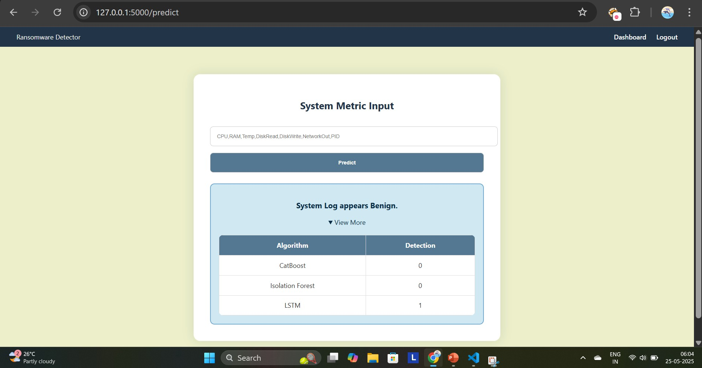
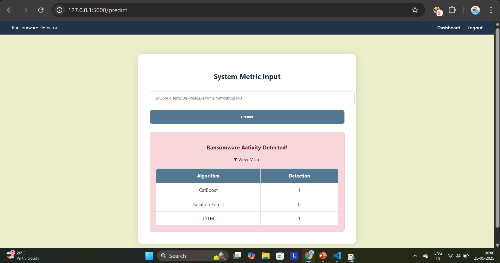

# Project Setup Guide

Follow the steps below to set up and run the project in a Python virtual environment.

### 0. Clone the Repository

Start by cloning the repository from GitHub:
```bash
git clone https://github.com/Badhrinathan/Ransomware-Behavioral-Footprinting.git
```
```bash
cd Ransomware-Behavioral-Footprinting/Application/
```
## 1. Create a Virtual Environment

First, install a virtual environment using Python:
```bash
python -m venv finalpro
```
Note: If you encounter an error related to execution policy on Windows, run the following command in PowerShell as Administrator:

Set-ExecutionPolicy RemoteSigned -Scope CurrentUser

## 2. Activate the Virtual Environment
On Windows (PowerShell or Command Prompt):
```bash
.\finalpro\Scripts\activate
```
## 3. Install Required Packages
Once the virtual environment is activated, install all dependencies with:
```bash
pip install -r requirements.txt
```
## 4. Run the Application
To run the application, execute:
```bash
python app.py
```

## Sample Logs

### Benignware Behavioral Log

```bash
100.0,54.4,76.125,274.84,1149.54,19.39,15111
```



### Ransomware Behavioral Log

```bash
88.8,49.7,82.375,128.43,5725.27,0.05,1826
```


---

